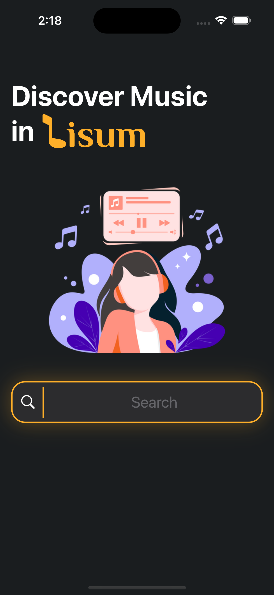

# Lisum
Discover music in Lisum, fully built in UIKit. 

# Menu
* [Screenshots](#screenshots)
* [Tech](#Tech)
* [Source](#source)
* [Contributions](#contributions)
* [Contact](#contact)

# Screenshots

  

* Pull Up For More!

* Custum Alert & Empty View

  

# Tech

* Dark / Light mode support
* Pull up for more
* Environment tint color
* Custum alert
* iPad support
* No third party libraries
* Pull to refresh

### To-Do

* Onboarding screen
* Custom empty view
* Settings view
* Search history

# Source

###API

[iTunes Search](https://performance-partners.apple.com/search-api)

[iTunes LookUp](https://developer.apple.com/library/archive/documentation/AudioVideo/Conceptual/iTuneSearchAPI/LookupExamples.html)

### Library

No third party library.

# Contributions

* All kinds of contributions (enhancements, new features, documentation & code improvements, issues & bugs reporting & todo task) are welcome. Let's make it better.

# Contact
Created by [Terry Kuo](https://bento.me/terrykuo) - feel free to contact me!
